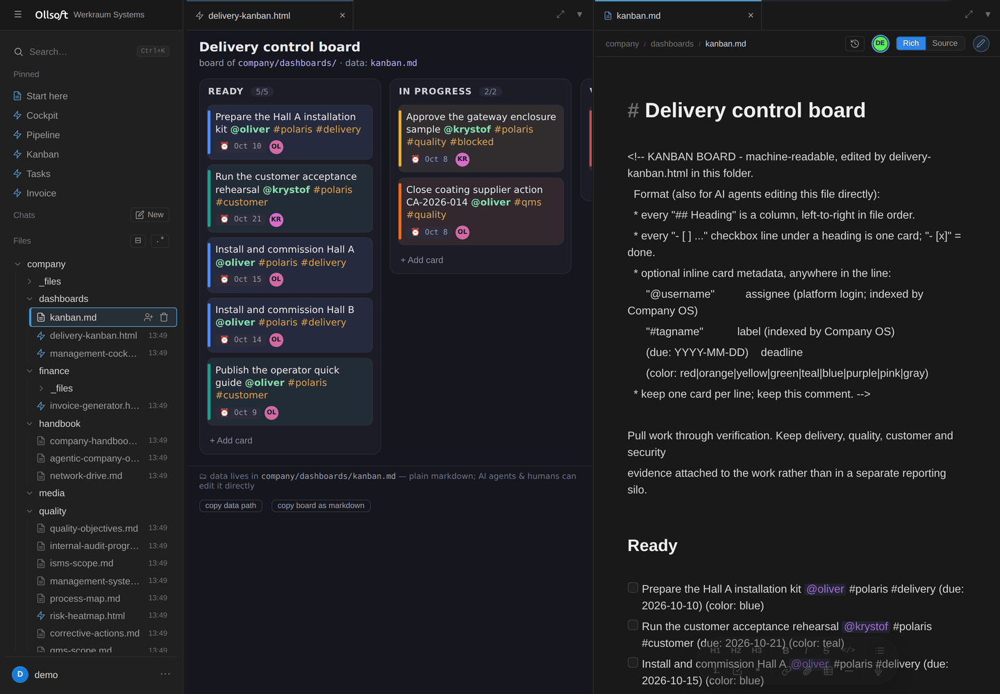
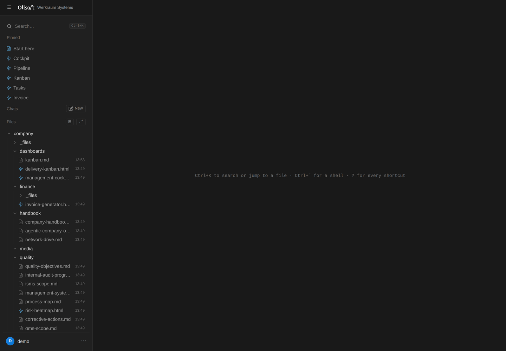
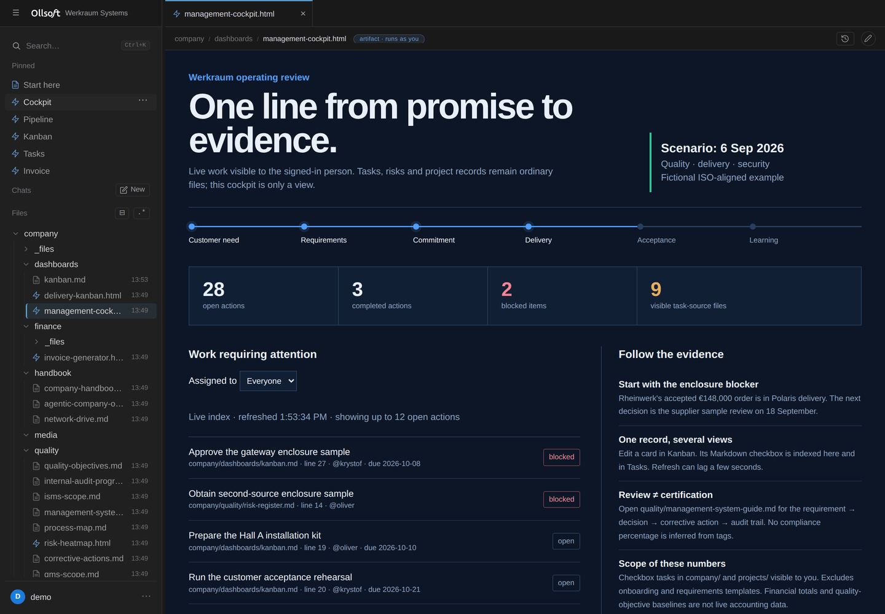
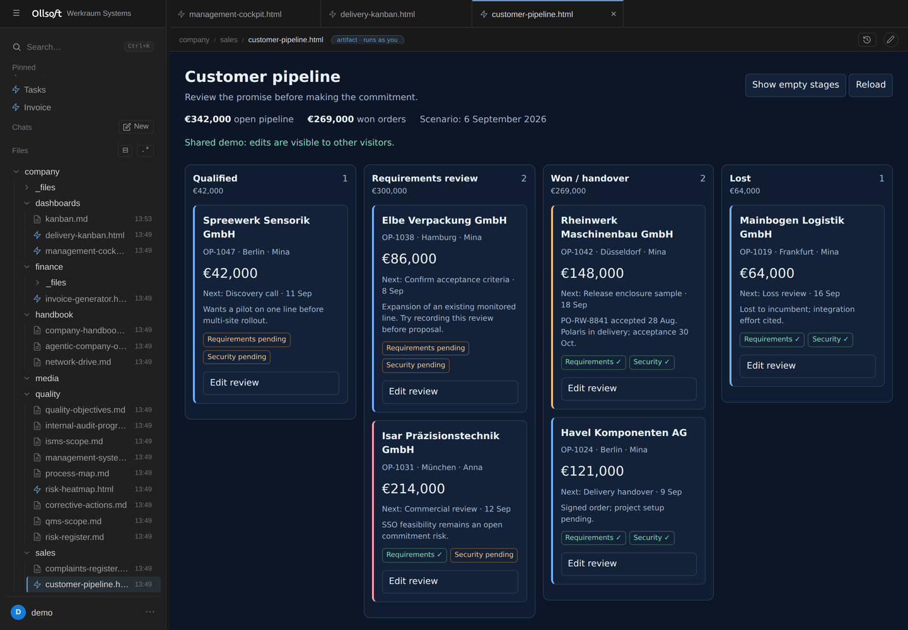
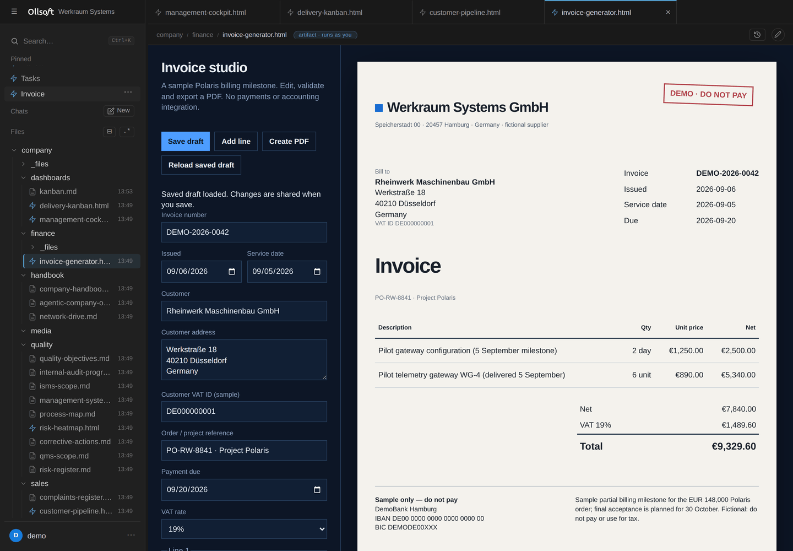
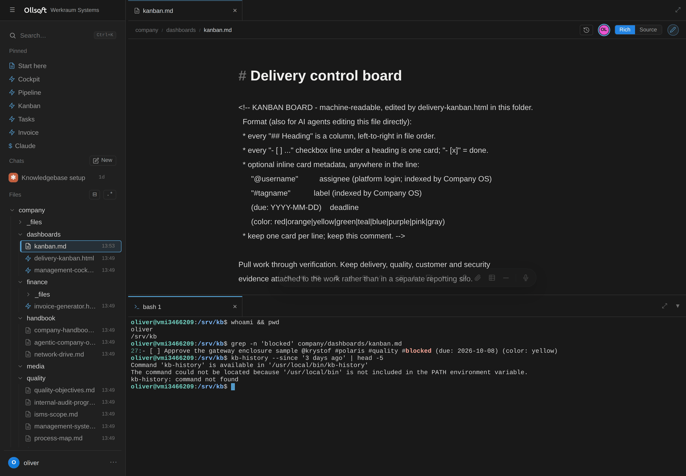

# Ollsoft Company OS

An **OS-native, AI-agent-native company knowledgebase**. Think "Obsidian, but
multiplayer, permissioned, and built for agents" — running on a single Linux box.



*The board on the left is stored in the markdown file on the right. Edit either;
both are the same task. A person, a dashboard and an AI agent all work on the
same file.*

**Free for up to three named users**, and free for any number of users for sixty
days while you evaluate it. Above that, production use in an organisation needs a
commercial licence — [info@ollsoft.ai](mailto:info@ollsoft.ai). The source is
public either way: read it, audit it, build it, run it for development or
testing. Every version becomes Apache 2.0 four years after its release.
Details in [LICENSE](LICENSE).

## Install it with your AI agent

An AI agent on your own computer walks you through the whole thing: renting a
server (Hetzner or Contabo), hardening it, installing, putting it on your domain
behind Cloudflare, and then — one question at a time — branding, voice
dictation, semantic search, AI agents, accounts, starter content, monitoring and
backups — and at the end it moves your existing knowledge in from Notion,
Obsidian, Confluence, Google Drive, SharePoint or git. You answer questions and
click through two dashboards; it does the rest over SSH and checks every step.

```bash
git clone https://github.com/Ollsoft-ai/ollsoft-company-os.git
cd ollsoft-company-os
claude        # then type: /install-company-os
```

- **Claude Code** picks the skill up from this repo
  (`.claude/skills/install-company-os/`).
- **Codex, Hermes Agent or any other agent:** start it in the cloned folder and
  say *"Read `.claude/skills/install-company-os/SKILL.md` and follow it."*
- You need `ssh` (built into macOS, Linux and Windows 10+), about an hour, a card
  for the server and, optionally, a domain.
- Interrupted? Run it again — it keeps a state file and resumes.
- It asks before switching on the **anonymous weekly ping** (version, how many
  users, which Linux, whether installs and updates worked — never a hostname, an
  IP, a name or anything from your documents) and before setting up
  **automatic updates**. `sudo kb-telemetry show` prints the exact bytes;
  [docs/telemetry.md](docs/telemetry.md) and [docs/updates.md](docs/updates.md).

Prefer to run the commands yourself? See **[Install by hand](#install-by-hand)**.

## Design

The design rests on three ideas:

1. **Markdown files are the source of truth.** Everything lives as plain `.md`
   files in a git repo at `/srv/kb`. The database is a *disposable* index you can
   drop and rebuild from the files at any time.
2. **One Linux user per human. The kernel enforces access.** Every web request is
   served by a process running *as that OS user* (`runuser`), so the kernel — not
   application code — decides what each person can read and write. Postgres
   Row-Level Security mirrors the same Unix permissions, so search and SQL can
   never return a file you couldn't `cat`.
3. **Everything composes on files + Unix + Postgres.** Multiplayer editing, task
   aggregation, live dashboards, agents, sharing — none of them need a bespoke
   permission system. They inherit the kernel's.

There is no permission table in this codebase. That is the whole point.

---

## What it looks like


*Documents in a tree you can see all of — and nothing you may not.*


*Every open task from every document **you are allowed to read**, blocked work
first. No second task list to keep in step.*


*A CRM is just an artifact in a folder. It runs as the person who opened it, so
it can only touch what they could.*


*…and so is an invoice generator, which writes its PDF back into the folder
beside the contract it came from.*


*A real shell in the browser, as your own Linux account. The same permissions as
everything above, because they are the same permissions.*

## Requirements

Ollsoft Company OS needs a **whole machine** — a VM or bare metal running **Ubuntu 24.04**.

It cannot run in an unprivileged container, and that is by design rather than an
oversight: it creates real Linux accounts, authenticates against PAM, spawns
processes as individual users, and relies on systemd and Postgres peer auth. A
container with fake users would run, but it would be a demo of the UI with the
security model removed — the part worth having.

Budget a small VM: 2 vCPU / 4 GB RAM / 20 GB disk is comfortable for a team.

---

## Install by hand

```bash
git clone https://github.com/<you>/ollsoft-company-os.git
cd ollsoft-company-os
sudo bash scripts/install.sh --admin <your-username>
```

That single command installs system packages, creates the `kb-users` group and
the `kbindexer` service account, builds the frontend, lays out `/srv/kb` with the
right modes and ACLs, creates the Postgres cluster objects and RLS schema, writes
`/etc/kb/kb.env`, and enables the four systemd services. It is idempotent — re-run
it to upgrade.

It creates exactly one account: yours. A generated password is written to
`/root/ollsoft-company-os-admin.txt` (delete it after your first login), or pass your own
with `--admin-pass`.

If `--admin` adopts an existing key-only cloud account, check it with
`passwd -S <your-username>`. A status of `L` or `NP` means PAM cannot use it for
the Company OS web login; set a separate login password with
`sudo passwd <your-username>`. This does not enable SSH password authentication.

Then open **http://127.0.0.1:8300**. It binds to localhost only. From your laptop:

```bash
ssh -L 8300:127.0.0.1:8300 you@your-box
```

See **[docs/remote-access.md](docs/remote-access.md)** before exposing it to a
network — it needs a TLS front door and an identity layer. To work on the
knowledgebase from Explorer — open and save Office files as if it were a
network share — see **[docs/windows-drive.md](docs/windows-drive.md)**.
To work with the knowledgebase through Claude Code or Codex, see
**[docs/agent-cli.md](docs/agent-cli.md)**.

### Options

| Flag | Default | Meaning |
|---|---|---|
| `--admin <user>` | *required* | Admin account to create, or adopt if it exists |
| `--admin-pass <pw>` | generated | Password for a newly created admin |
| `--repo <path>` | `/srv/kb` | Where the knowledgebase lives |
| `--prefix <path>` | `/opt/kb-platform` | Where code is deployed |
| `--port <n>` | `8300` | Hub port on 127.0.0.1 |
| `--admin-group <g>` | `sudo` | OS group granting platform-admin rights |
| `--no-packages` | — | Skip `apt-get` (dependencies already present) |
| `--no-start` | — | Install without enabling the services |

### Try the permission model

```bash
sudo bash scripts/seed-demo.sh
```

Creates `alice`, `bob` and `carol`, plus a `projects/acme/` folder restricted to
the `proj-acme` group. Alice and Bob are members; Carol is not. Log in as Carol:
the folder is absent from her file tree, absent from search, and
`SELECT * FROM kb.blocks` returns none of its rows either — the RLS policy
re-checks the same Unix permission for every row. Undo with `--undo`.

---

## What it does

- **Multiplayer markdown editing** on the files themselves (browser + `vim` +
  agents all merge through one CRDT; the `.md` file *is* a CRDT peer). Every
  document save is versioned in a root-only git repo with the real author
  recorded; users read their permitted history via `kb-history` or the editor's
  history panel — never git directly.
- **Live presence & cursors**: see who has a doc open and each collaborator's
  named cursor moving in real time, in both rich and source views.
- **Rich or source editing**: a rendered-but-editable view (headings, bold, links,
  interactive checkboxes, images) over the same markdown — with a formatting
  toolbar and drag-drop / screenshot-paste that stores files and renders them
  inline — or a raw-source view with line numbers. One toggle, same document.
  Inline `code` carries its own copy button; tagging a colleague with `@name`
  colours them in the text when the name is a real account here, and a tag of
  **you** glows yellow; and pasting a URL writes the markdown link — over a
  selection it links that selection, on its own it links to itself.
- **Link what is already there**: drag any file or folder from the tree into an
  open document and it becomes a link at the drop point — images and video embed,
  documents open as a tab when you click through.
- **Kernel-enforced permissions**, surfaced through a web file tree, editor, and a
  real in-browser terminal (each running as your OS user).
- **The tree puts recent work on top**: folders stay alphabetical so navigation
  never moves, while the files inside each one are ordered newest-first and
  carry a subtle last-modified stamp.
- **Drop in what you already have**: drag files — or whole folders, subfolders and
  all — from your desktop onto any folder in the tree (or right-click it →
  *Upload folder*); everything lands with live per-file progress, then converts
  and becomes searchable. Take it back the same way: right-click any folder →
  *Download as ZIP*.
- **VS-Code-style shell**: documents and artifacts open as tabs (background
  artifacts stay live); terminals are tabbed in a docked, resizable bottom panel.
- **Cron panel**: every user has their own `crontab`; the UI lists, adds, pauses
  and deletes jobs, which run as the user even while logged out.
- **Read-only viewing** of files you can see but not edit (live, but the daemon
  refuses to persist your edits).
- **Dictation** (`F9`, hold-to-talk or tap-to-latch): speech-to-text that lands
  wherever you were already typing — a document, a **terminal**, the command
  palette, any field. The ElevenLabs key is a company credential at
  `/etc/kb/elevenlabs.key` (`0600 root:root`): every logged-in user may spend it
  through the hub, nobody may read it, and the caller never picks the upstream
  URL. See [docs/dictation.md](docs/dictation.md).
- **Search by meaning and by words** — full-text + vectors (pgvector) fused and reranked, in any language, RLS-scoped per user; `kb-search` for agents; hard spend caps. Optional: plug in your own provider keys ([docs/semantic-search.md](docs/semantic-search.md)).
- **Task search** over the same Postgres index.
- **To-dos**: `- [ ] task @assignee #tag` checkboxes aggregated across everything
  you can see, filterable, with write-back to the source file.
- **Sandboxed artifacts**: agent-written HTML dashboards that query the database
  and read, write, list, create and delete files in their own folder *as the
  viewer*, contained by an opaque-origin iframe + CSP.
- **File sharing**: per-file and per-folder ACLs via a permissions UI, including
  automatic traverse-grants so a share actually reaches the file.
- **Admin UI** (admin group only): create and remove users, create groups, assign
  membership — full provisioning of the OS account, home, private dir, Postgres
  role and personal schema.
- **AI agents** run as each user, with shared context and company **skills** in
  the repo teaching Claude Code and Codex how to use the platform.

---

## Architecture at a glance

```
                          browser  (session cookie, https + websocket)
                              │
                     ┌────────▼─────────┐
                     │   kb-hub · ROOT  │   PAM login → signed cookie.
                     │  127.0.0.1:8300  │   Spawns & reverse-proxies per-user
                     └───┬──────────┬───┘   backends. Privileged /fs/* + /admin/*.
        runuser -u <you> │          │  /ws/doc  (+ signed uid/gids token)
      ┌──────────────────▼──┐   ┌───▼──────────────────┐
      │  user backend       │   │   kb-syncd · ROOT     │  y-websocket CRDT relay +
      │  runs AS <you>      │   │  file daemon; writes  │  filesystem merge. Preserves
      │  files·pty·sql·tasks│   │  .md, preserves owner │  owner/group/mode. Read-only
      │  artifact bridge    │   └───────────┬──────────┘   viewers can't mutate.
      └──────────┬──────────┘               │ inotify ⇄ Yjs
                 │ peer auth                 ▼
        ┌────────▼─────────┐    /srv/kb  ·  git-versioned markdown = TRUTH
        │   PostgreSQL     │◀── kb-indexer (user kbindexer): parses md → rows,
        │  RLS = Unix      │    refreshes group membership, honors POSIX ACLs.
        │  read + traverse │    Disposable · rebuildable · Postgres FTS.
        └──────────────────┘
                                kb-convert (same user): office/PDF binaries →
                                hidden read-only .md sidecars, so their text is
                                searchable and agent-readable like any doc.
```

The two root services (`kb-hub`, `kb-syncd`) do only auth, proxying, and the
CRDT/file merge — the small, auditable surface. Everything touching a user's data
runs *as that user* (`runuser`, peer auth) or re-checks their Unix bits.

Full component tour: **[docs/ARCHITECTURE.md](docs/ARCHITECTURE.md)**.
Capacity ceilings, growth hygiene and the drift watchlist: **[docs/SCALING.md](docs/SCALING.md)**.

---

## Where things are

- **Code layout, the dev loop, how to add a view, running the tests** —
  [docs/DEVELOPING.md](docs/DEVELOPING.md)
- **Install, upgrade, every `/etc/kb/kb.env` variable** —
  [docs/SETUP.md](docs/SETUP.md)
- **How it is put together, and why** — [docs/ARCHITECTURE.md](docs/ARCHITECTURE.md)
- **Updates and the release channels** — [docs/updates.md](docs/updates.md)
- **What the anonymous ping sends** — [docs/telemetry.md](docs/telemetry.md)

---

## Two trails: what changed, and who changed access

They answer different questions, and reaching for the wrong one is the usual
mistake.

**Content history — what a document said, and who wrote it.** Every edit is a
git commit attributed to the OS user who made it. The socket identifies the
caller with `SO_PEERCRED`, so this needs no privileges of its own and everyone
can read their own history.

```bash
kb-history --since '7 days ago'                  # everything you can see
kb-history --since yesterday --author alice      # what one person worked on
kb-history path/to/doc.md --show --rev <sha>     # what it used to say
kb-history path/to/doc.md --restore --rev <sha>  # put it back
```

Readability is enforced per request against the kernel, so it can only ever show
you documents you could open anyway.

**Privileged-action audit — who changed who can see what.** The hub records
the sharing and account events below, one greppable line each, to journald.
This is the question `kb-history` cannot answer: it tracks content, never
permissions.

```bash
journalctl -u kb-hub -g AUDIT --since yesterday
```

```
hub AUDIT share.set actor=alice result=ok path='company/HR/x.md' scope='people'
hub AUDIT login actor=mallory result=DENIED source='203.0.113.4'
```

Events: `login`, `share.set`, `props.set`, `group.member`, `user.create`.
Denials are recorded too — a refused attempt is the more interesting half when
someone is probing.

**Access audit — who opened what.** Three more events record permission being
*used* rather than changed, on the same line format:

```bash
journalctl -u kb-hub -g 'AUDIT (document.open|file.preview|file.download|folder.download)' --since yesterday
```

```
hub AUDIT document.open actor=bob result=ok path='company/HR/x.md'
hub AUDIT file.download actor=bob result=ok path='company/HR/rates.xlsx' bytes=48211
```

`document.open` is a live editing session that was joined and accepted;
`file.preview` and `file.download` are an attachment the server served inline or
as an explicit download. They are written only *after* the kernel has already
allowed the read, so a refusal can never look like one — and nothing else under
`/api/*` is recorded, because a trail that logged tree polling and search would
be a surveillance stream with the signal buried in it.

Only root and members of `sudo`/`adm`/`systemd-journal` can read it; journald
shows everyone else nothing but their own messages, so the people being audited
cannot read the audit.

**Know the limits before relying on it.** An access event is the server's word
that it served the bytes — never proof that a person read, understood or kept
the file, and never a measure of how someone spends their day. Reads outside the
app (SSH, the mounted drive, the search index) are still invisible, so a missing
event is not evidence that nothing was opened. Nor is every admin action
recorded: deleting a user, switching an account between full and viewer,
creating or deleting a group, and editing the artifact egress allow-list all
happen without a line. Anything done as root or directly on disk bypasses it.
Anyone with `sudo` can edit the journal, so it is evidence about users, not
about administrators. And journald rotates, so old entries age out silently —
the mutation events start 2026-08-25, the access events 2026-08-29, and neither
can reconstruct anything earlier.

Agents investigating an incident should load the **`kb-audit`** skill, which
covers the patterns worth chasing and — as importantly — the normal platform
noise that is not worth reporting.

## Security posture

Read **[docs/SECURITY.md](docs/SECURITY.md)** before putting this anywhere.

The design is deliberate and has been hardened: the privileged root surfaces
(`/fs/*`, `/admin/*`, `kb-syncd`) use symlink-safe `openat`/`O_NOFOLLOW`
operations, `.git` is root-only so history can't bypass file permissions, and
artifacts run in an opaque-origin sandbox with no network. The security model is
tested, not just asserted — `tests/cli/test_rls.py`, `test_security_fixes.py`,
`test_visibility.py` and the e2e sandbox tests exercise it directly.

That said: **this has not been externally audited.** It binds to localhost by
design. Do not expose it to a network without a TLS front door and an identity
layer in front, and read the threat model first.

Found a security problem? Please report it privately rather than opening a public
issue — see [SECURITY.md](docs/SECURITY.md) for the contact.

---

## Contributing

See **[CONTRIBUTING.md](CONTRIBUTING.md)**. The short version: there is no
permission code to add — if a feature seems to need one, it probably wants a Unix
mode, an ACL, or a Postgres grant instead.

## License

**Business Source License 1.1** — [LICENSE](LICENSE), [NOTICE](NOTICE), and the
plain-language summary at the top of this page. Commercial licensing:
[info@ollsoft.ai](mailto:info@ollsoft.ai).

Built at [Ollsoft](https://ollsoft.ai).
