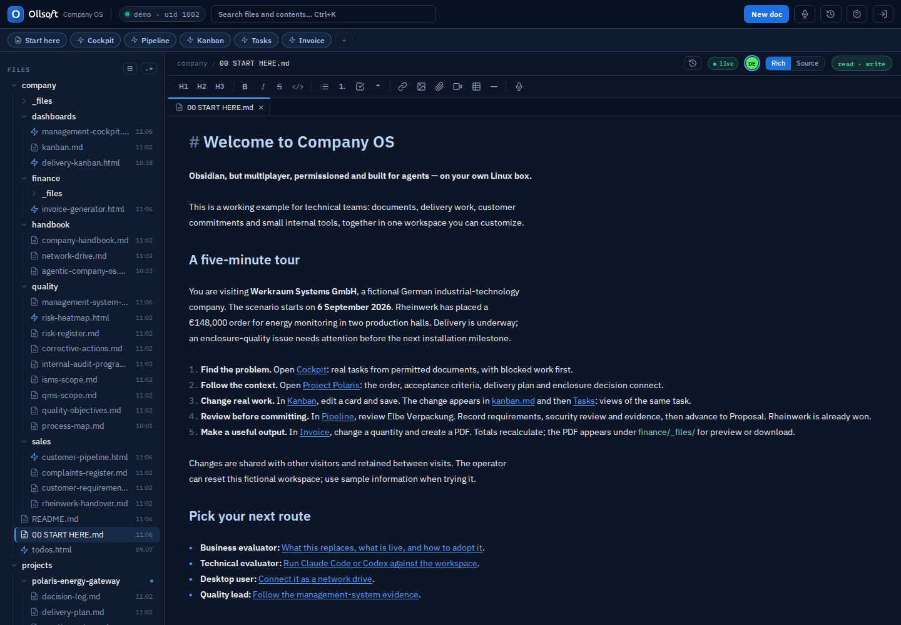
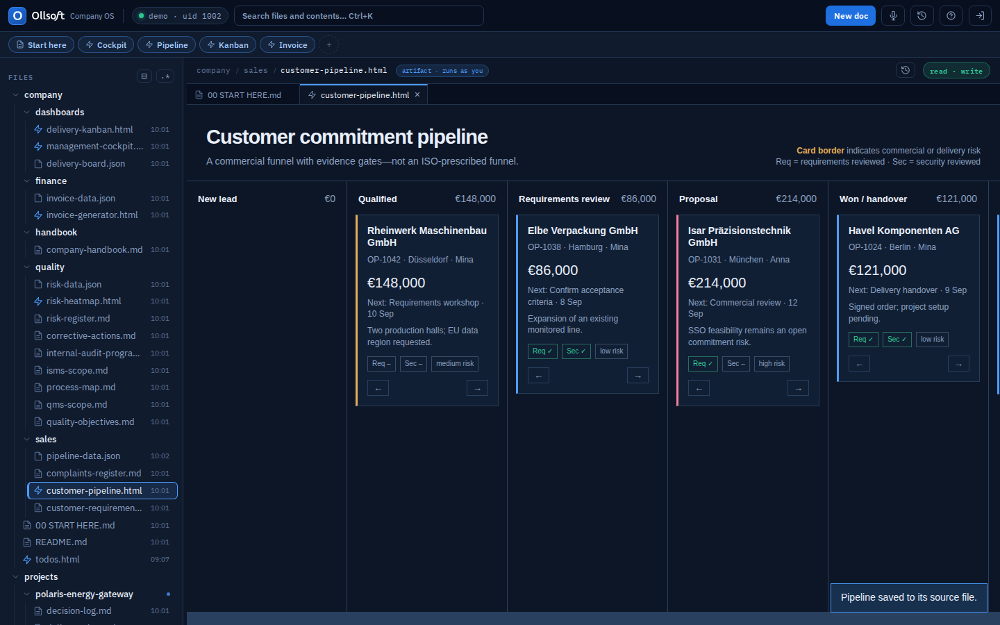
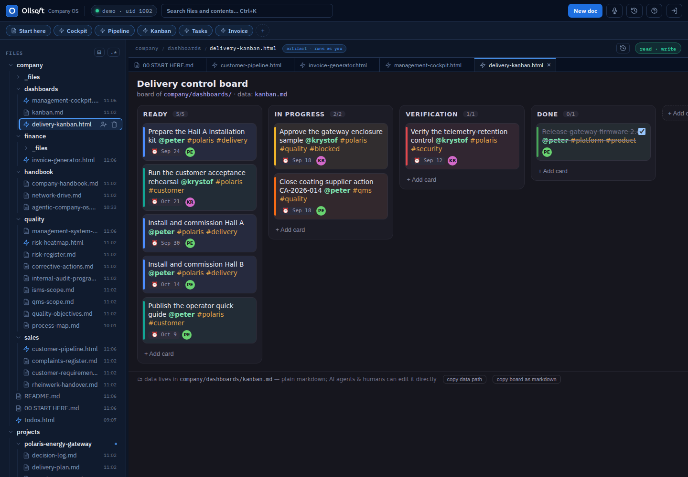
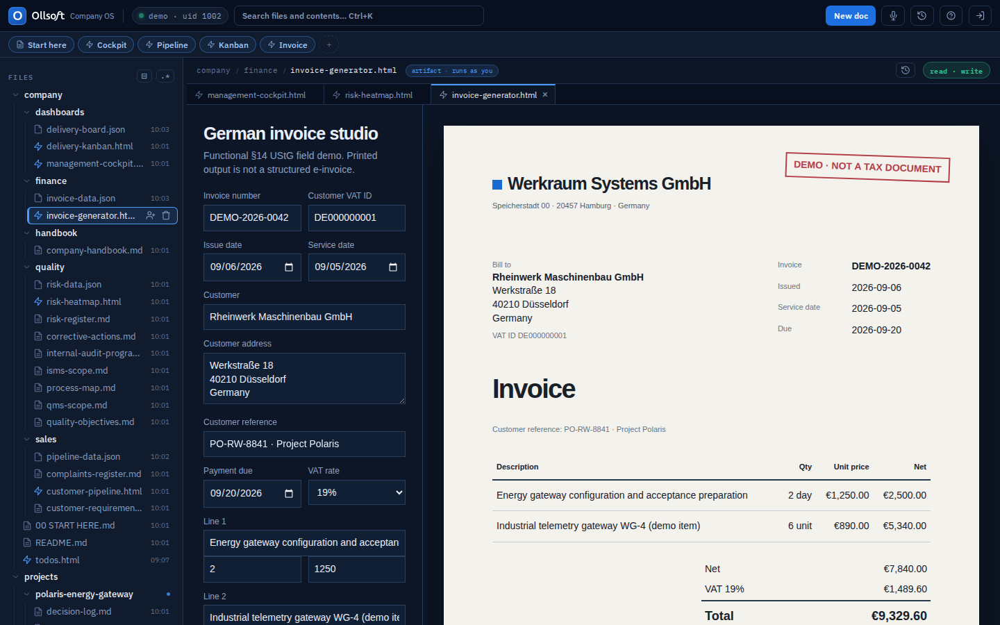

# Company OS, in practice

**Obsidian, but multiplayer, permissioned and built for agents — running on a
Linux box your company controls.**

Company OS is a shared workspace for technical teams who want to shape their own
tools. Write together, assign work where the decisions happen, build small apps
beside the documents, and let Claude Code or Codex work with the same files.
Linux accounts and permissions govern access across these interfaces.

[Start the five-minute tour](00%20START%20HERE.md).

## Why a team would use it

A customer promise is easy to lose between a CRM, a project board, a shared drive
and meeting notes. Here the requirement, decision, task and internal tool can
live together, with links that let a colleague or agent follow the work.

| Need | What to try here |
|---|---|
| Find the reasoning behind delivery work | Follow [Polaris](../projects/polaris-energy-gateway/README.md) from its requirements to its enclosure decision. |
| Stop maintaining a second task list | Change a [Kanban](dashboards/delivery-kanban.html) card, then inspect [the Markdown](dashboards/kanban.md) and [Tasks](todos.html). |
| Build a tool around your own process | Edit an opportunity in [Pipeline](sales/customer-pipeline.html), or generate a sample invoice PDF. |
| Delegate useful work to an agent | Ask Claude to draft a delivery brief from existing evidence in your personal folder. |
| Keep ordinary desktop tools | Mount the files over SFTP and open them in your usual editors. |

## One believable company story

Werkraum Systems GmbH is a fictional Hamburg manufacturer of energy-monitoring
gateways. All content is in English; the example businesses are German.

Rheinwerk's **OP-1042 / PO-RW-8841** order is won at **€148,000**. The
[requirements and handover record](sales/rheinwerk-handover.md) leads to
[Project Polaris](../projects/polaris-energy-gateway/README.md), targeting
acceptance on **30 October 2026**. A coating defect in batch B-441 threatens
delivery: follow the decision, risk and corrective action to see the evidence.
The invoice is a **€7,840 net sample milestone**, not the whole contract.

## What is connected today

- **Live:** Markdown edits merge across browsers and filesystem writers. Task
  views and the cockpit update from the index. History records supported
  document changes; each person's search follows their permitted files.
- **Interactive examples:** the pipeline, risk view and invoice studio are
  customizable HTML artifacts. Pipeline and invoice working state uses hidden
  JSON files; it is separate from document history. Published evidence belongs
  in Markdown and generated files belong in `_files/`.
- **Explicit handovers:** winning a deal does not create a project, invoice or
  email automatically. This demo links prepared records; you can build those
  automations with scripts, agents and scheduled jobs.
- **AI:** Claude is preinstalled for Peter and Krystof. Each user signs in with
  their own AI account. An agent can access the files its Linux user can access;
  self-hosting Company OS does not make a cloud AI provider run locally.

## Questions I would ask before adopting it

**Is this a complete ERP or accounting system?** It is a customizable knowledge
and work platform. The CRM and invoice tools show what a team can build; invoice
samples are not production accounting or structured e-invoices.

**Who operates it?** Someone on your team owns a Linux VM: updates, accounts,
access reviews, backups and restore checks. Company OS uses real Linux users,
systemd and PostgreSQL. Start with one team and one process.

**What can we customize?** Documents, project structure, permission groups,
HTML artifacts, agent skills and scheduled jobs. The platform source is
Git-versioned. Your workspace documents are ordinary files you can take with you.

**Can everyone edit everything?** Shared company content is collaborative.
Projects can be restricted by group, and personal workspaces are private.
The `demo` account is web-only, not read-only. Peter is a full non-admin user.

**What happens if two people edit?** Markdown has live collaborative editing.
JSON tools detect stale saves and ask you to reload; simultaneous JSON writes
are not transactional collaboration. Office files do not have live co-authoring.

**Does this make us ISO certified?** No. The sample processes illustrate
evidence, ownership, review and improvement. See the
[management-system guide](quality/management-system-guide.md) for the references
and the boundary between example evidence and certification.

## Try a small pilot

Choose a current project, import its documents, invite two colleagues with named
accounts, and build one task or approval view. Check whether a newcomer can find
the latest decision, its owner and its evidence without asking around.

[Company handbook](handbook/company-handbook.md) ·
[Agent onboarding](handbook/agentic-company-os.md) ·
[Network drive](handbook/network-drive.md) ·
[Quality and security evidence](quality/management-system-guide.md)
